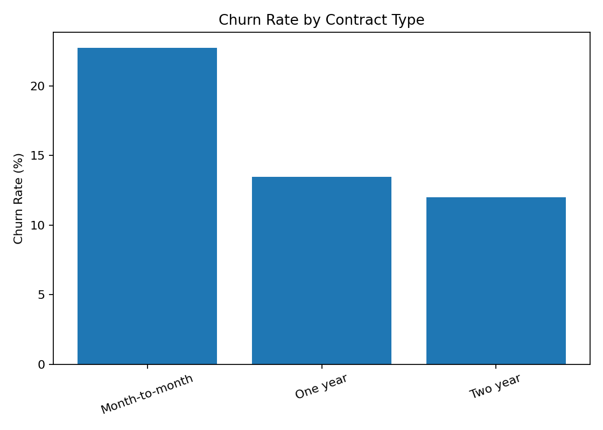
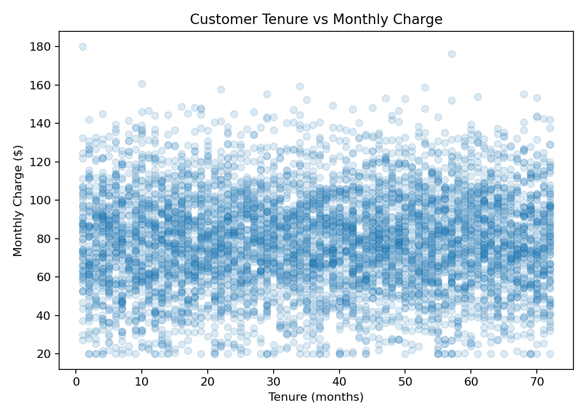

# Customer Retention Analytics

This project explores customer churn patterns using Python and pandas. The analysis focuses on how contract type, tenure, monthly charges, support activity, and payment behavior relate to customer retention.

## Technologies
- Python
- pandas
- matplotlib

## Dataset
The dataset contains 6,000 synthetic customer records covering customer tenure, monthly charges, support tickets, contract type, automatic payment enrollment, premium plan enrollment, and churn status.

## Analysis
The project examines overall churn rate, churn by contract type, churn by support activity, churn by automatic payment enrollment, and customer tenure and pricing patterns.

## Repository Structure
```text
data/
    customer_churn.csv
outputs/
    churn_by_autopay.csv
    churn_by_contract.csv
    churn_by_contract.png
    churn_by_support_tickets.csv
    summary_kpis.csv
    tenure_vs_charge.png
analysis.py
README.md
```

## Running the Project
```bash
pip install pandas matplotlib
python analysis.py
```

## Sample Output



